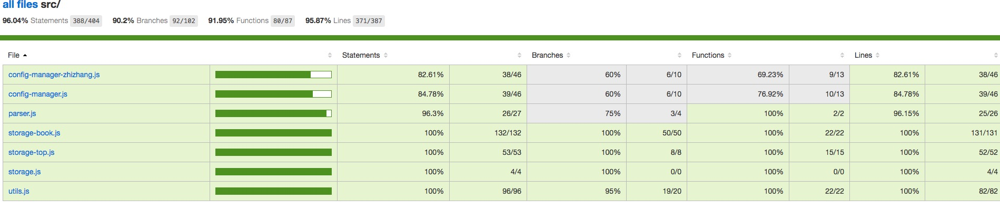

# Unit Tests

Due to the complexity fo the viewing part, only the core lib is tested. But the test frame is already established(including Node api), you can test it if you want.

## Test procedures and results

jasmine is used as unit test frame, instanbul is used to collect coverage ratio, so the tests need to be write under jasmine standards.
All the test files are under spec folder, your work is:

1. Create a test file under spec folder named like "[name].spec.js".
2. Use [jasmine standards] to write teat cases, be aware, 'mock-fs' lib is imported to generate virtual folders and files and used in 'stronge-book' 'storage-top' libs' test cases.
3. run'grunt test' to start to unit test.
4. Use browser to open 'reports/coverage/lcov-report/index.html' to check coverage ratio result.

