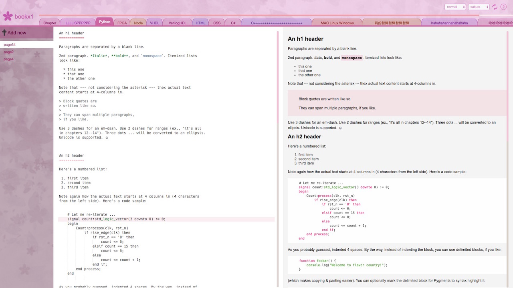
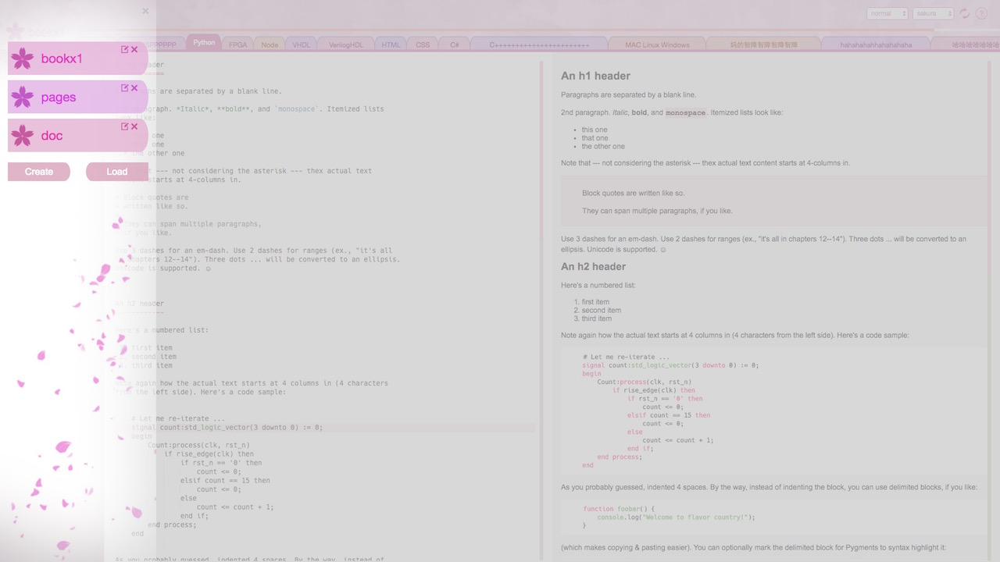
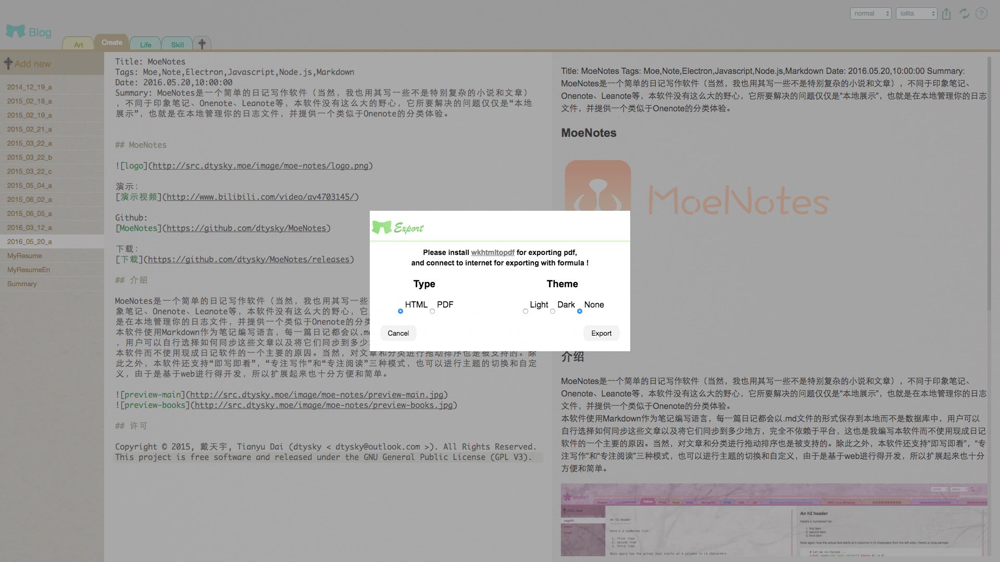

# Overview

  

Chinese documents:  
[Overview](../zh)  

Demo：  
[Demo Video](https://youtu.be/UhnbvLA0SMo)  

Github:  
[MoeNotes](https://github.com/dtysky/MoeNotes)  

Download：  
[Download](https://github.com/dtysky/MoeNotes/releases)  

# Introduction
 
MoeNotes is a dairy software, unlike Onenote, Leanote, it's running locally, and the problem is solved is "local demonstration", used to provide a Onenote like experience at manage your dairy categories.
THe app uses markdown is it's editing language, all notes will be saved as .md file locally instead of database, user can choose how these files are synchronized independent of platforms. It supports sorting articles by dragging them around. Besides, it has 'live preview', 'read' and 'write' three modes, exporting to pdf or html file, and themes can be switched or customized. Since it's based on web, it can be easily extended.

  
  
  

## Folder

Normal user 
- [Quick Start](./QuickStart.md)
- [Theme PreDefined](./Theme-PreDefine.md)

Advanced user
- [Customize Theme](./Theme-Advance.md)

Developer
- [Environment](./Development-Environment.md)
- [Grunt Tasks](./Development-Tasks.md)
- [Core Libs](./Development-Cores.md)
- [React Components](./Development-Components.md)
- [Unit Test](./Development-UnitTests.md)

Thanks
- [Used tool and materials](./Thanks.md)

## License

Copyright © 2015, 戴天宇, Tianyu Dai (dtysky<dtysky@outlook.com>). All Rights Reserved. This project is free software and released under the GNU General Public License (GPL V3).